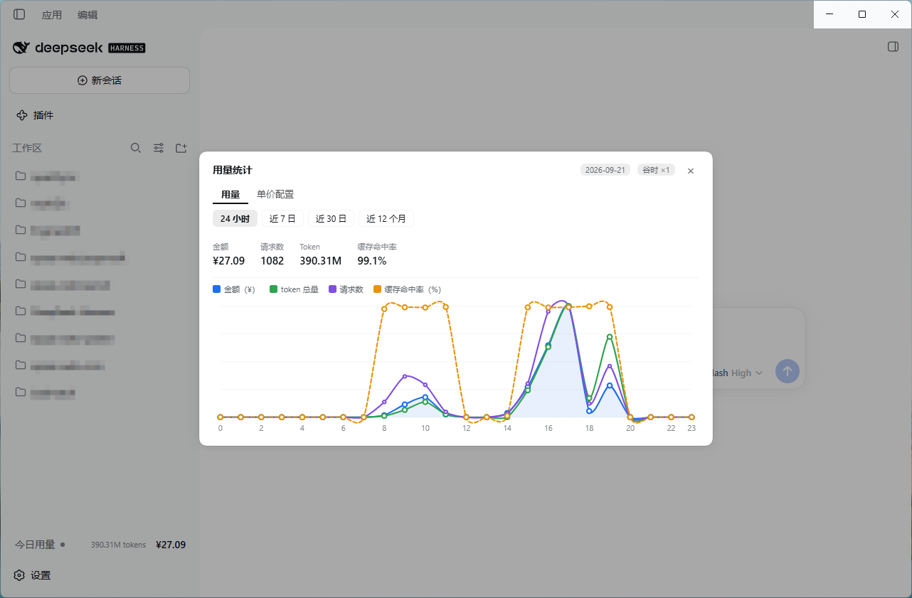

# dsh-usage-badge

DeepSeek Harness 的用量徽标插件：侧边栏底部一行「今日用量」显示当天的 token 总量与估算费用，点开可看 24 小时 / 近 7 日 / 近 30 日 / 近 12 个月的用量，并按 **DeepSeek 官方定价**和**中国法定节假日**计价。



零依赖、零构建：宿主半只用 Node 内建模块，浏览器半是手写的单文件 bundle，折线图是手写 SVG。

## 安装

需要 Node ≥ 22.15，以及带 `dsh plugin` 命令的 DSH。

```sh
# 从 npm 安装
dsh plugin --profile web add dsh-usage-badge

# 或者从本地源码路径安装（把 <本仓库路径> 换成实际路径）
dsh plugin --profile web add <本仓库路径>
```

装完**重启客户端**。卸载：

```sh
dsh plugin --profile web remove dsh-usage-badge
```

## 用起来

侧边栏底部、就在「设置」上方那一行，从左到右是：**「今日用量」标签 · 峰谷圆点 · 当天 token 总量 · 当天金额**。每 5 秒自动刷新，鼠标移上去看明细（金额 / token / 请求数 / 当前档位），点一下打开弹窗。侧边栏收起时这一行缩成一个小方块。

**峰谷圆点**：谷时灰色，峰时橙色 —— 鼠标停在圆点上会显示 `峰时 ×2` / `谷时 ×1` / `国庆节 · 全天空闲`。

弹窗有两个页签：

- **用量** —— 四个时间区间（`24 小时` / `近 7 日` / `近 30 日` / `近 12 个月`）、按 provider 筛选、金额/请求数/Token/缓存命中率四项合计，以及一张四序列折线图（金额、token 总量、请求数、缓存命中率）。鼠标移到图上显示该点的四项数值和参考线。

  区间按**自然日 / 自然月**切分：`近 7 日` 就是最近 7 个连续自然日，没有用量的那天保留自己的空槽位，不会把窗口拉长成 8 天。
- **单价配置** —— 官方定价、法定节假日日历、当前生效单价。

## 单价：只有一个来源

**就是 DeepSeek 官方定价页。** 打开「单价配置」时会实时抓取并解析它（中文页人民币 / 英文页美元），确认无误后点「应用官方价格」写入。

面板里**没有任何要手填的字段** —— 汇率、币种、倍率都不需要配置（官方中文页就是人民币，徽标也始终是人民币）。想给网关上的其他模型单独定价，或者加自定义节假日，直接改下面那个 `pricing.json` 即可，改完即时生效。

官方页面改版导致解析失败时，面板会报错并保留原价格，不会静默算错。想核对线上页面是否还能解析：`node test/official-pricing.live.mjs`。

## 峰谷与节假日

官方规则：**周一至周五（不含中国法定节假日）9:00-12:00、14:00-18:00 是高峰时段**，其余时段 —— 包括周末和法定节假日**全天** —— 都按空闲价。

插件内置了中国法定节假日日历（2025–2026，取自国务院办公厅的放假安排通知），所以落在工作日上的节假日不会被按峰价计费。

**周末永远按空闲价**，即使国务院把它调休成上班日也一样：官方原文是把「周末」整体划作空闲时段的，调休后的周日仍然是周日。

## 文件放在哪

```
~/.dsh/storages/usage-badge/
├── pricing.json    价格表（「应用官方价格」写的就是它）
└── cache.json      会话日志的折叠缓存（可以随时删，会自动重建）
```

插件只**读**DSH 的会话日志（`~/.dsh/sessions`），不改动它们；`jsonl` 和 `jsonl.zstd` 都支持。

## 已知限制

- **首次启动要冷扫一遍全部会话日志**（200 多份实测约 10 秒；分片让出事件循环，界面不会卡住）。之后走增量，几乎瞬时。
- **历史依赖日志**：日志被删掉后靠缓存继续计入；缓存也丢了，那段历史就没了。
- **只统计 DSH 记进日志的调用**：某个东西直接请求外部 API 且不向 DSH 上报 usage，这部分统计不到。
- **数字是估算**：token 口径和官方账单的列数不同，**对账请以金额为准**。

## 开发

```sh
npm install   # 只为测试装 react / react-dom
npm test      # 5 个套件：包契约、定价、节假日、官方定价解析、浏览器半渲染
```

改了东西怎么生效：

| 改了哪里 | 要做什么 |
|---|---|
| `lib/client.js`（界面、图表） | **刷新页面**即可 |
| `lib/index.js` 等宿主半 | **重启客户端** |

更详细的东西（实现取舍、官方政策原文、路由清单、配置字段语义、当年的踩坑记录）在 [docs/design-notes.md](docs/design-notes.md)。

## License

MIT
